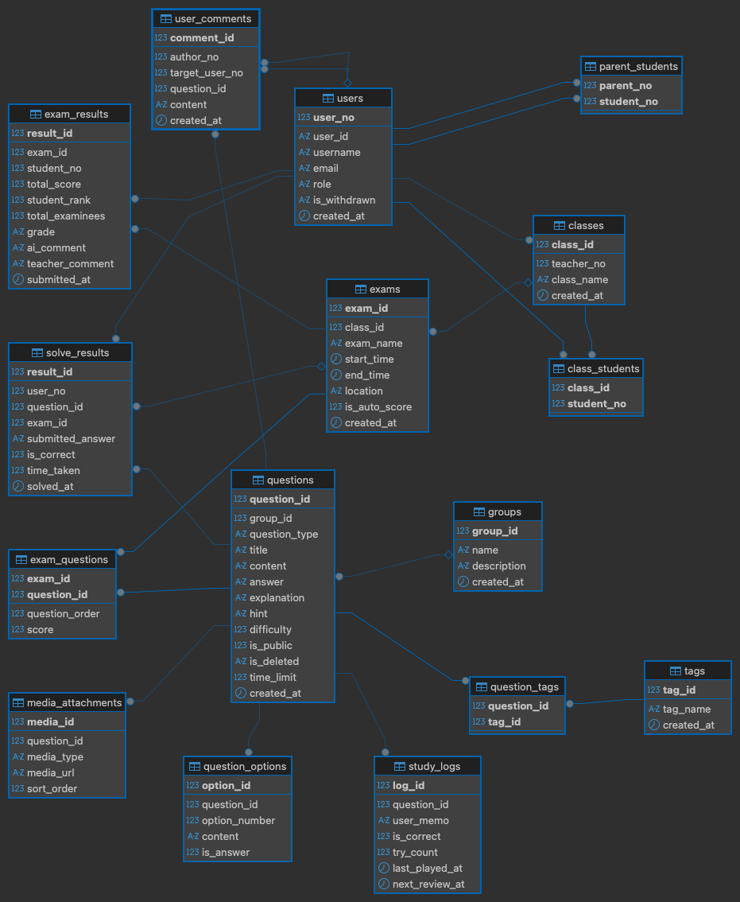

# 📕 AI Edu-Hub(가칭) 프로젝트 기획안

> 선생님의 퇴근을 당기고, 학생의 성적을 뒤집는 단 하나의 "AI 학습 관리 솔루션"

## 1. 프로젝트 개요
* **서비스 명**: AI Edu-Hub (가칭)
* **내용**: 문제생성 및 관리(문제은행, AI 채점, 오답노트, AI 해설, AI 튜터링, AI 성적 분석, AI 학습 스케줄링, AI 학습 리포트)를 통한 지식학사관리
* **목표**: 교사의 단순 업무 경감, 학생을 위한 초개인화 맞춤형 학습 제공, 학부모를 위한 투명한 학습 데이터 확인
* **웹/앱 플랫폼 형태**: 웹(반응형), PWA(Progressive Web App)를 결합한 SaaS 교육 플랫폼

---

## 2.  시스템 아키텍처 & 기술 스택

### Frontend: Nuxt.js (Vue 3 기반)
* **선정 이유**: 첫 화면 렌더링을 매우 빠르게 처리(SSR)해 검색 엔진 최적화(SEO) 및 사용자 경험 향상 지원. PWA 설정을 통해 모바일 앱과 유사한 경험을 제공하기 용이함.
* **역할 구분**: 교사용 대시보드(웹 최적화), 학생용 문제 풀이 앱(모바일 최적화), 학부모 리포트 뷰.

### Backend: NestJS (Node.js 프레임워크)
* **선정 이유**: TypeScript 기반의 모듈화 아키텍처로 엔터프라이즈급 안정성 제공. 복잡해지는 비즈니스 로직(AI 채점, 스케줄링)을 체계적으로 구조화하기 좋음.
* **주요 역할**: RESTful API 제공, 회원 인증/인가(JWT, OAuth), 백그라운드 스케줄링 작동, 외부 API(GPT, 알림 등) 연동.

### Database & ORM: MySQL + Prisma
* **선정 이유**: MySQL(관계형 데이터베이스)의 검증된 안정성에 직관적인 Prisma ORM의 타입 안정성 결합. 차후 TiDB 등 클라우드 DB로의 확장이 원활함.
* **주요 역할**: 사용자 계정, 학급, 디지털 문제 뱅크, 학습 결과 등 핵심 영구 데이터 보관.

### AI Engine: OpenAI (GPT-4o API)
* **주요 역할**: Vision 기능을 활용한 이미지 OCR(복잡한 수식/그래프 텍스트 추출), 문맥 및 의미를 추론하는 서술형/주관식 채점 프로세싱 및 다정한 해설 자동 생성.

---

## 3. 💾 핵심 DB 모델링 초안 (MySql)

 
---

## 5.  핵심 기능 상세 흐름 파이프라인

### ① [교사] 0.5초 디지털 문제 생성 흐름 (시간 혁명)
1. **촬영 & 업로드**: 교사가 폰이나 PC로 문제집 이미지를 촬영하여 업로드합니다.
2. **AI 데이터 변환**: NestJS 백엔드가 해당 이미지를 GPT-4o Vision API로 전송하여 복잡한 수식과 기호를 포함한 텍스트로 추출, `Question` 테이블에 즉시 저장합니다.
3. **가공 & 배포**: 추출 결과물에 교사가 유튜브 강의 URL 등을 손쉽게 덧입힐 수 있는 에디터 UI를 제공하여 바로 과제나 시험지로 배포 구성을 마칩니다.

### ② [학생] AI 스마트 채점 & 극복 알고리즘 (성적 혁명)
1. **의미 기반 채점 로직**: 주관식 문제를 풀 경우, 학생의 답안(`studentAnswer`)과 Мо범 답안(`answer`)을 묶어 GPT API로 검수하여, 핵심 키워드와 문맥이 일치하면 정답(`isCorrect: true`)으로 처리합니다.
2. **복습 스케줄링 큐**: 틀린 문항이나 오답률이 높은 문항의 경우, NestJS의 내부 스케줄러 모듈을 통해 `nextReviewDate`를 오늘로부터 '1일 뒤', '3일 뒤', '7일 뒤' 등으로 갱신 세팅합니다. 이를 통해 학생이 로그인하면 자동으로 복습 과제가 뜨게 됩니다.

### ③ [학부모] 자동 안심 리포트 및 통계 (신뢰 혁명)
1. **이벤트 트리거**: 한 번의 과제/시험 세션이 완료(Submit)되면 백엔드의 Event Emitter가 구동됩니다.
2. **자동 발송**: 채점 통계 및 학생의 약점 분석 데이터가 정리되는 즉시 Nodemailer(이메일 발송) 또는 커스텀 API(카카오톡 알림톡 등)를 통해 자녀와 연결된 `parentId` 즉 학부모 계정으로 자동 고지가 발송됩니다.

---

## 6. 🗓️ 단계별 시스템 개발 마일스톤

| 단계 (Phase) | 핵심 목표 달성 과제 | 세부 개발 내용 |
| :---: | :--- | :--- |
| **Phase 1**   (기반 구축) | 백엔드/프론트엔드 프로젝트 셋업 및 DB 설정 | Node.js(NestJS), Vue 3(Nuxt.js) 보일러플레이트 구성 / DB(Prisma) 마이그레이션 / 구글 및 카카오 소셜 로그인 연동 모듈 기초 개발 |
| **Phase 2**   (교사 시스템) | 문제 은행 디지털화 및 학급 권한 구축 | S3 이미지 업로드 서버 구축 / **GPT-4o Vision API 연동을 통한 OCR 텍스트 자동 스캔 엔진** 도입 / 학급 생성 및 학생 할당 기능 |
| **Phase 3**   (학생 시스템) | 반응형 문제 풀이 앱 개발 및 AI 채점망 | 스마트폰 맞춤형 문제 풀이 및 제출 컴포넌트 개발 / **GPT 프롬프트 엔지니어링 기반 주관식 스마트 채점 및 에빙하우스 복습 스케줄러** 적용 |
| **Phase 4**   (확장/안정화) | 커뮤니티 피드 구축 및 알림 자동화 통합 | 학생들이 모르는 문제를 질문하는 상호작용 피드 도입 / 학부모 카카오톡/이메일 안심 리포트 자동 발송 파이프라인 마무리 통신 설정 |
    `question_id` BIGINT        PRIMARY KEY AUTO_INCREMENT   COMMENT '문제 고유 번호',
